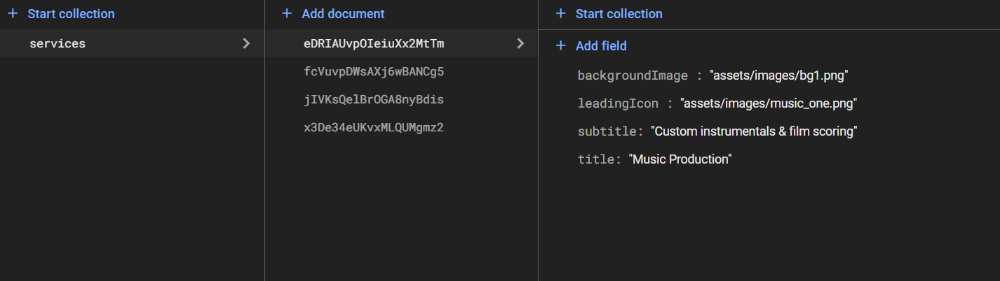

# s_rocks_music

A Flutter project that recreates the **Music Services Module (Single Screen)** for the S.Rocks.Music app.

---

## Overview

This app demonstrates:

- Responsive UI built in Flutter matching a Figma design.
- Fetching dynamic data from **Firebase Firestore**.
- State management using **Provider**.
- MVVM architecture (View, ViewModel, Repository).
- Dependency Injection with **get_it**.
- Navigation on tapping service cards.
- Clean, maintainable code structure.

---

## Features

- ✅ Clean and responsive UI built with Flutter and ScreenUtil
- ✅ Recreated from Figma design: [Figma Link](https://www.figma.com/design/YAsYsNFGxmoauPpSLrUMtF/Assignment---Flutter?node-id=0-1)
- ✅ Each card displays service info (icon, title, subtitle)
- ✅ Tap on any service card to navigate to a detail screen
- ✅ Firebase Firestore used to fetch service data dynamically
- ✅ MVVM architecture implemented
- ✅ State management using **Provider**
- ✅ Dependency Injection using **get_it**
- ✅ Proper folder structure for scalability and maintainability

---
## 🚀 Splash Screen

This project includes a custom Flutter splash screen that displays the **S-Rocks-Music** branding before loading the main content.

- Implemented using standard Flutter widgets.
- Fully controllable — you can set the duration, animations, or transitions.
- Enhances the app's first impression and aligns with branding.

> ⏱️ Current duration: ~3 seconds before navigating to the home screen.

- Splash screen implemented in `lib/splash_screen.dart`
- Shown as the initial screen before navigating to `HomeView`


## Getting Started

### Prerequisites

- Flutter SDK installed ([Flutter Install Guide](https://flutter.dev/docs/get-started/install))
- Firebase account and project set up

### Installation

1. Clone this repository:
    ```bash
    git clone https://github.com/bhuan9904/s_rock_music.git
    cd s_rock_music
    ```

2. Install dependencies:
    ```bash
    flutter pub get
    ```

3. Firebase Setup:

    This project uses Firebase Firestore and was configured using the FlutterFire CLI:

    ```bash
    flutterfire configure
    ```

    To run the app on your machine, add your Firebase config files:

    - Place your `google-services.json` in `android/app/`
    - Place your `GoogleService-Info.plist` in `ios/Runner/`

    > **Note:** These files are not included in the repository for security reasons.

4. Run the app:
    ```bash
    flutter run
    ```

---

## Folder Structure

lib/
├── home/
│ ├── home_view.dart           # UI (View)
│ ├── home_view_model.dart     # ViewModel (logic + state)
│ ├── home_service.dart        # Repository (Firebase fetching)
│ ├── service_model.dart       # Data Model
│ └── widgets/                 # UI components like cards, nav bar
├── locator.dart               # Dependency Injection setup (get_it)
└── main.dart                  # App entry point


---

## 🔥 Firebase Firestore Structure

### Collection: `services`

Each document in this collection represents a service card on the home screen.

| Field           | Type   | Description                          |
|----------------|--------|--------------------------------------|
| `title`        | String | The main title of the service        |
| `subtitle`     | String | Short description of the service     |
| `backgroundImage` | String | Asset path or image URL used as card background |
| `leadingIcon`  | String | Asset path or icon for the service   |

### Example Document:
```json
{
  "title": "Music Production",
  "subtitle": "Get your music produced by professionals",
  "backgroundImage": "assets/images/bg1.png",
  "leadingIcon": "assets/images/music_one.png"
}

Here is the Firestore database structure used in this project:



## Architecture

- **MVVM** (Model-View-ViewModel) architecture pattern for clean separation of concerns.
- **Provider** package for state management.
- **get_it** package for dependency injection to manage singletons and service location.
- Firebase Firestore integration for dynamic data loading.

---

## Screenshots / Demo

### 🏠 Splash Screen


### 🏠 Home Screen


### 📄 Details Screen


## 📽️ Demo Video

🎬 [Click here to watch the demo](assets/screenshots/demo.mp4)
---

## Contact

If you'd like to get in touch, feel free to reach out:

    - **Name:** Ch Bhuvan Kumar  
    - **Email:** chbhuvi111@gmail.com  
    - **LinkedIn:** [ch-bhuvan-kumar](https://www.linkedin.com/in/ch-bhuvan-kumar)  
    - **GitHub:** [bhuan9904](https://github.com/bhuan9904)


Thank you for reviewing my project! 🚀
